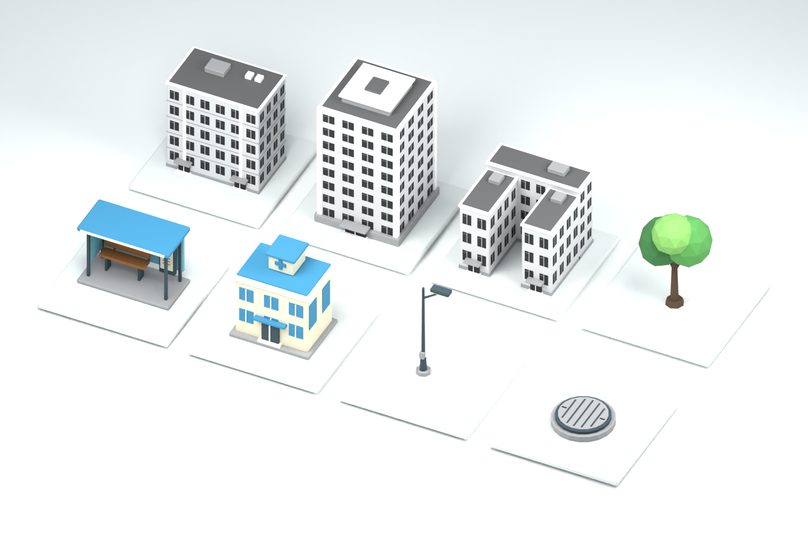
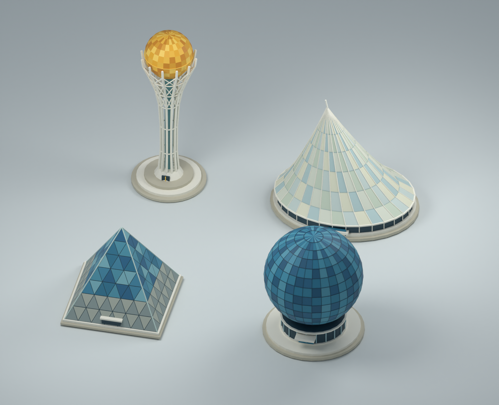

# Аким на 5 часов

AI-симулятор управления городом. Пользователь получает фиксированный бюджет в 100 условных
единиц, принимает ровно пять управленческих решений по транспорту, экологии, соцсфере,
безопасности и городским сервисам и получает **Astana Quality of Life Score** с разбором
того, что сработало, чем он за это заплатил и что осталось недоделанным.

Кейс: спец-трек Astana Innovations.

---

## Главный архитектурный принцип

**Числа считает код. Языковая модель их только объясняет.**

Техническое задание формулирует это прямо: *«LLM получает результат расчёта и объясняет его,
сравнивает наборы, советует. Числа он не считает и не придумывает»*. Мы сделали это не
пожеланием в промпте, а свойством архитектуры:

```
Решения пользователя
   ↓
lib/engine/validate.ts    правила → список нарушений с причинами
   ↓
lib/engine/score.ts       формула → ScenarioBreakdown (все числа, окончательные)
lib/engine/attribution.ts вклад каждой меры по Шепли
lib/engine/solver.ts      полный перебор пространства решений
   ↓
lib/ai/explain.ts         модель пересказывает ScenarioBreakdown словами
lib/ai/agent.ts           модель вызывает движок как инструмент
```

Модель физически не может ошибиться в арифметике, потому что арифметику ей не поручают.
На вход она получает готовый JSON с посчитанными значениями, а агент вместо догадок
«какой набор лучше» вызывает `optimize` — полный перебор, который возвращает точный ответ.

Если ключа ИИ нет вообще, симулятор продолжает работать: `describeScenario()` собирает
разбор детерминированно, из того же `ScenarioBreakdown`. ИИ здесь — украшение поверх
готового результата, а не источник истины. Ответ модели проходит проверку контракта
(`readExplanation`, покрыт тестами): всё, что ей не соответствует, отбрасывается,
и пользователь видит детерминированный разбор вместо сломанного экрана.

Разборы кэшируются по набору решений: движок детерминированный, поэтому один и тот же
сценарий не запрашивается у модели дважды.

---

## Запуск

Нужен Node 22 и pnpm.

```bash
pnpm install
pnpm dev
```

Откройте http://localhost:3000 — **никаких переменных окружения для этого не требуется.**
Симулятор полностью работоспособен без ключей: бюджет, правила, расчёт балла, таблица
районов и детерминированный разбор сценария доступны сразу.

Чтобы включить ИИ-слой (пересказ разбора живым языком и агент-советник), создайте `.env.local`:

```bash
cp .env.example .env.local
```

и заполните один из ключей:

```
AI_PROVIDER=openai          # openai | nvidia | openrouter
OPENAI_API_KEY=sk-...
```

### Проверка

```bash
pnpm test      # 26 тестов: движок, контракт ответа модели, кривая, детектор выдуманных чисел
pnpm lint
pnpm build
pnpm ai:check  # живая проверка ИИ-слоя: виден ли ключ, отвечает ли модель, соблюдает ли контракт
pnpm ai:audit  # доказательство, что агент не выдумывает числа (см. ниже)
pnpm frontier  # пересчёт границы достижимого (нужен только после правки данных в lib/domain/city.ts)
```

`pnpm ai:check` стоит прогнать перед демонстрацией — протухший ключ лучше обнаружить
заранее, чем на защите. Скрипт делает три шага: простой запрос к модели, разбор
эталонного сценария из ТЗ и вопрос агенту с инструментами.

---

## Проверка за две минуты

Всё, что нужно, чтобы убедиться, что решение работает и считает правильно.

**1. Поднять без единой настройки.**

```bash
pnpm install && pnpm dev
```

Открыть http://localhost:3000. Симулятор работает: бюджет, правила, балл, карта города.

**2. Убедиться, что числа сходятся с ТЗ.**

```bash
pnpm test
```

Тридцать четыре теста. Среди них — эталонные значения прямо из технического задания:
база без решений 52.56, пример допустимого набора 56.54 при стоимости 95, оценка
Есиля 62.99. ТЗ просит перепроверить эти числа кодом — вот эта проверка.

**3. Воспроизвести пример из ТЗ руками.**

Нажать «Пример из ТЗ» — подставится набор M7, M8, M10 в Нуру, M12 на город,
M5 в Сарыарку. Балл должен показать **56,54**, стоимость 95, сработавшую синергию
Safe City с платформой обращений и ноль критических показателей.

Та же ссылка напрямую:
[`/?s=M7:nura,M8:nura,M10:nura,M12,M5:saryarka`](http://localhost:3000/?s=M7:nura,M8:nura,M10:nura,M12,M5:saryarka)

**4. Проверить, что бюджет нельзя превысить.**

Попробовать добавить шестое решение или выйти за 100 единиц — карточки гаснут
до клика, а под ними написана причина. Убрать одну меру из набора: балл исчезает,
вместо него появляется «Нужно ровно 5 решений».

**5. Убедиться, что решения влияют на результат.**

Заменить любую меру — балл меняется. Включить стресс-тест «Авария на теплосети»
— балл проседает, и видно, на сколько именно.

**5а. Проверить, что балл объясним без чтения этого файла.**

Вкладка «Что изменилось» под каталогом показывает каждый сдвинувшийся показатель
в виде «было → стало» по районам, счётчик провалов «2 → 0» и вклад каждой меры
с поправкой на лаг. Ссылка «Как считается балл?» в карточке результата раскрывает
формулу и веса. Ни одно из этих чисел не проходит через языковую модель.

**6. Проверить ИИ-слой.**

```bash
cp .env.example .env.local   # вписать OPENAI_API_KEY
pnpm ai:check
```

Скрипт покажет провайдера и модель, сделает простой запрос, разберёт эталонный
сценарий и задаст вопрос агенту. В выводе должно быть `источник: модель` и
трассировка вызванных инструментов.

Без ключа шаги 1–5 всё равно проходят: разбор сценария собирается движком.

---

## Три провайдера ИИ, один клиент

`lib/ai/provider.ts` — тонкий клиент к OpenAI-совместимым эндпоинтам. Поддержаны
**OpenAI**, **NVIDIA NIM** и **OpenRouter**: путь `/chat/completions`, заголовок `Bearer`
и формат сообщений у них одинаковые. Различий ровно три, и все три учтены:

| | OpenAI | NVIDIA NIM | OpenRouter |
|---|---|---|---|
| Базовый URL | `api.openai.com/v1` | `integrate.api.nvidia.com/v1` | `openrouter.ai/api/v1` |
| Перебор моделей | на нашей стороне | на нашей стороне | умеет сам, поле `models[]` |
| Поле `reasoning` | не принимает | не принимает | обязательно выключать |

Перебор моделей реализован **клиентским циклом**, а не проприетарным полем `models[]`:
массив моделей понимает только OpenRouter, остальные вернут на него ошибку. Цикл идёт
по всем провайдерам, у которых есть ключ: первая ответившая модель выигрывает. Это защита
от главного риска демонстрации — падения одного провайдера в неподходящий момент.

Переменная `AI_MODEL` переопределяет модель списком через запятую.

---

## Модель расчёта

### Данные

Пять условных районов, по десять показателей в каждом. Шкала 0–100, больше — лучше;
проблемы вроде пробок и смога уже «перевёрнуты», поэтому 100 означает отсутствие проблемы.
Каталог — 14 мероприятий со стоимостью, лагом и эффектами. Всё лежит в
[`lib/domain/city.ts`](lib/domain/city.ts) ровно в тех значениях, что даны в ТЗ.

Данные синтетические, персональных или ограниченных сведений не содержат.

### Формула

```
1. I'[d][k] = clip(I[d][k] + Σ эффект × (8 − лаг)/8 + синергии, 0, 100)
2. D[d]     = Σ w[k] × I'[d][k]
3. D_avg    = Σ доля_населения[d] × D[d]
4. Score    = 0.7 × D_avg + 0.3 × min(D[d]) − 1.0 × N_crit
```

`N_crit` — число пар «район × показатель» со значением строго ниже 40.

Два слагаемых формулы кодируют управленческую дилемму, и симулятор построен вокруг них:

- **30% веса на худшем районе.** Вложиться в благополучный Есиль почти бесполезно: средний
  балл подрастёт на копейки, а `min(D)` не сдвинется. Нура с её 49.18 тянет треть итога.
- **Лаг режет эффект.** ЛРТ стоит 30 из 100 и даёт самые крупные цифры в каталоге, но при
  лаге 4 за горизонт в 8 кварталов реализуется ровно половина. Дешёвые быстрые меры
  с лагом 1 отдают 87.5%.

### Верификация модели

ТЗ просит перепроверить эталонные числа кодом. [`lib/engine/score.test.ts`](lib/engine/score.test.ts)
прибивает их намертво:

| Что | Значение | Источник |
|---|---|---|
| База без решений | **52.56** | задано в ТЗ |
| Пример допустимого набора | **56.54** (+3.99), стоимость 95 | задано в ТЗ («≈56.5, +4.0») |
| Оценка района Есиль | **62.99** | задано в ТЗ |
| Глобальный оптимум | **57.24** (+4.68), стоимость 98 | найден полным перебором |

Тесты также проверяют, что валидатор называет причину для каждого нарушенного правила
и что несовместимые пары отклоняются — включая то, что `M4`+`M7` конфликтуют только
в пределах одного района, а в разных допустимы.

---

## Что именно делает агент

Пространство решений маленькое: 14 мероприятий по 5, у «районных» мер ещё выбор из 5 районов.
После отсечения по бюджету, лимиту направлений и конфликту `M1`/`M3` остаётся **694 395
валидных сценариев** — это секунды процессорного времени. Поэтому оптимизацией занимается
код, а не модель.

Агенту даны три инструмента поверх движка:

| Инструмент | Что делает |
|---|---|
| `score_scenario` | считает балл набора и вклад каждой меры |
| `validate_scenario` | проверяет правила, возвращает причины отказа |
| `suggest_improvement` | ищет сценарий лучше текущего; по умолчанию не фиксирует ничего |
| `optimize` | перебор под особые условия: «а если бюджет 70», «а если совсем без ЛРТ» |

Инструменты знают текущий набор пользователя и сами считают `deltaVsCurrent` для
каждого найденного варианта. Поэтому модель не может выдать набор хуже текущего за
улучшение: если прироста нет, кнопка «применить» просто не появляется, а агент
честно отвечает, что сценарий уже оптимален. Это разделение возникло из живого
прогона — модель сначала зажимала перебор, передавая все пять текущих мер как
обязательные, и получала в ответ тот же самый набор.

Модель решает, *что* спросить у движка, и переводит ответ на человеческий язык. Интерфейс
показывает трассировку вызовов — видно, что стоит за каждой цифрой в ответе.

Благодаря `optimize` агент отвечает на контрфактические вопросы честным расчётом:
«а если урезать бюджет до 70?», «а если отказаться от ЛРТ?» — это параметры перебора,
а не повод для фантазии.

### Как мы доказываем, что агент не врёт в цифрах

Обещание «модель не считает» ничего не стоит, пока его нельзя проверить. Поэтому
оно проверяется механически:

```bash
pnpm ai:audit
```

Скрипт гоняет агента по шести вопросам, забирает сырые ответы инструментов и
вытаскивает из текста агента **каждое число**. Любое, которого не было ни в выводе
движка, ни среди констант правил игры, считается выдумкой, и команда падает с
ненулевым кодом. Округление модели («около 56,5» вместо 56,54) выдумкой не считается —
это то же число, просто короче.

Последний прогон на `gpt-4o-mini`:

```
OK   1. Как улучшить мой сценарий, не выходя за бюджет?   suggest_improvement   15 чисел
OK   2. Почему Нура тянет балл вниз?                      score_scenario         4 числа
OK   3. Что будет, если отказаться от ЛРТ?                optimize               2 числа
OK   4. А если бюджет урежут до 70 единиц?                optimize               1 число
OK   5. Какой набор лучший, если начинать с нуля?         optimize              13 чисел
OK   6. Сравни мой сценарий с оптимальным                 score_scenario,
                                                          optimize               6 чисел

Проверено чисел: 41. Вопросов с выдуманными числами: 0.
```

Заодно видно, что на каждый вопрос агент берёт подходящий инструмент: «как улучшить» —
поиск улучшения, «а если бюджет 70» и «а если без ЛРТ» — перебор с ограничениями,
«почему район тянет вниз» — расчёт текущего набора.

Сам детектор ([`lib/ai/audit.ts`](lib/ai/audit.ts)) покрыт тестами: он обязан
пропускать числа из вывода инструментов и ловить подставленные.

### Вклад мер считается по Шепли

Наивная разность «с мерой минус без меры» врёт, когда работают синергии: бонус пары
достаётся той мере, которую убрали последней. [`lib/engine/attribution.ts`](lib/engine/attribution.ts)
усредняет по всем порядкам добавления — решений пять, значит подмножеств 32, и честный
расчёт стоит доли миллисекунды. Тест проверяет, что сумма вкладов сходится с общим приростом балла.

---

## Город в 3D

Решения видно не только в таблице. Пять кварталов застраиваются по оценке района:
чем выше балл, тем плотнее и выше дома, цвет уходит от красного к зелёному. Принятые
меры появляются на земле предметами — деревья за экологию, остановки за транспорт,
корпуса за соцсферу, фонари за безопасность, люки за коммунальные сервисы.



Четыре узнаваемые доминанты Астаны стоят на собственных площадях, которые застройка
не занимает ни при каком сценарии: Байтерек, Хан Шатыр, Дворец мира и Нур Алем.



**Двенадцать моделей, 1,3 МБ, ноль сетевых зависимостей.** Геометрия создана
воспроизводимыми генераторами Blender ([`public/models/source/`](public/models/source/)) —
ни одной скачанной модели, текстуры или стороннего дополнения. Для запуска приложения
Blender не нужен: готовые GLB лежат в репозитории, а
[паспорт комплекта](public/models/README.md) фиксирует габариты, число треугольников
и размер каждого файла.

На каждый вид модели приходится один `InstancedMesh`, поэтому число копий на карте
не влияет на количество вызовов отрисовки. Пока GLB грузится или если он почему-то
недоступен, карта показывает процедурную замену — сцена не ломается никогда.

---

## Сколько стоит балл качества жизни

Симулятор отвечает не только «сколько ты набрал», но и «сколько вообще можно было
набрать за эти деньги». [`scripts/build-frontier.ts`](scripts/build-frontier.ts)
прогоняет полный перебор для каждого уровня бюджета и складывает кривую в
`lib/domain/frontier.json`; страница получает её готовой и рисует мгновенно.

| Бюджет | Потолок | К базе | Тратит |
|---|---|---|---|
| 61 | 55.67 | +3.11 | 61 |
| 62 | 55.79 | +3.23 | 62 |
| 63 | 55.79 | +3.23 | 62 |
| 64 | 55.79 | +3.23 | 62 |
| 65 | 55.79 | +3.23 | 62 |
| 70 | 56.67 | +4.12 | 68 |
| 75 | 56.87 | +4.31 | 72 |
| 80 | 56.87 | +4.31 | 72 |
| 85 | 56.90 | +4.34 | 83 |
| 90 | 57.19 | +4.63 | 88 |
| 95 | 57.23 | +4.67 | 91 |
| 100 | 57.24 | +4.68 | 98 |

Кривая показывает то, ради чего кейс и придуман: **отдача от денег падает**.

Начинается она с 61 единиц — дешевле допустимого набора из пяти решений
не существует вовсе. Это `M4 + M9 + M10 + M11 + M12`, ровно тот набор, который назван
в ТЗ. Обратите внимание: минимальная стоимость и стоимость лучшего набора при малом
бюджете — разные величины, и скрипт считает их отдельно.

Дальше каждая единица бюджета от 61 до 70 приносит
**0.111** балла, а от 70 до 100 — всего **0.019**,
то есть примерно в 6 раз меньше. Для управленца это прямой ответ
на вопрос, стоит ли добивать бюджет до потолка: после 70 единиц деньги
почти перестают конвертироваться в качество городской среды.

График сидит на странице симулятора: пунктиром отмечен балл города без вмешательства,
линией — потолок при каждом бюджете, точкой — текущий сценарий пользователя. Палитра
проверена на разделимость при дальтонизме и контраст к тёмному фону, есть табличное
представление тех же данных.

Тест следит, чтобы кривая не отстала от движка: если поменять данные в
`lib/domain/city.ts` и забыть `pnpm frontier`, сборка упадёт.

---

## Соответствие обязательным требованиям

| Требование ТЗ | Где реализовано |
|---|---|
| Единый виртуальный бюджет для всех | `BUDGET = 100` в `lib/domain/city.ts`, одинаковые стартовые данные |
| Решения по пяти направлениям | каталог сгруппирован по направлениям, лимит «не больше двух» |
| Автоматический контроль превышения бюджета | `validate.ts` + `canAdd()` гасит недоступные карточки **до** клика |
| AI-анализ принятых решений | `lib/ai/explain.ts`, `lib/ai/agent.ts` |
| Расчёт итогового Score | `lib/engine/score.ts`, покрыт тестами |
| Объяснение сильных сторон, рисков и последствий | разбор делится на summary / strengths / tradeoff / risks / recommendations |
| Прозрачность расчёта | вкладка «Что изменилось»: показатели до и после, провалы «2 → 0», вклад каждой меры |
| Невалидный набор не считается, возвращается причина | `Violation[]` показывается вместо балла |
| Изменение решений меняет Score | отдельный тест |

Из опциональных пунктов сделаны три:

- **Визуализация изменений показателей районов** — три уровня подробности. Матрица
  «направление × район» над каталогом показывает слабые места ДО выбора мер: десять
  показателей свёрнуты в пять направлений теми же весами, которыми считается балл.
  Вкладка «Что изменилось» разбирает каждый сдвинувшийся показатель и каждую меру
  отдельно. Полная таблица 5×10 с дельтами лежит соседней вкладкой. Поверх всего —
  процедурная 3D-карта города, где высота и цвет застройки держат оценку района,
  а принятые меры появляются на земле предметами.
- **AI-рекомендации по улучшению сценария** — агент с полным перебором вместо догадок.
- **Сравнение результатов нескольких команд** — страница `/compare`: два сценария рядом,
  разница по каждому району, что у команд общего и чем наборы различаются, вклад каждой
  меры. Расчёт детерминированный, поэтому у обеих сторон получаются одинаковые числа —
  сравнивать можно без доверия друг к другу и без общего сервера: достаточно обменяться
  ссылками, сценарий целиком лежит в адресе.
- **Автоматическая генерация краткой презентации** — страница `/brief`: разбор сценария
  на один лист с таблицей решений, вкладом каждой меры, сильными сторонами, рисками
  и главным компромиссом. Печатается в PDF одной кнопкой. Сценарий закодирован в адресе,
  поэтому ссылкой можно обменяться — команды сравнивают наборы, просто переслав URL.
- **Моделирование неожиданных городских событий** — четыре стресс-теста
  ([`lib/domain/events.ts`](lib/domain/events.ts)): авария на теплосети, затяжной смог,
  приток населения, веерные отключения. Событие бьёт по показателям уже после того,
  как отработали меры, и, в отличие от них, не масштабируется лагом: авария случается
  сразу. Это проверяет сценарий на устойчивость, а не только на красоту итоговой цифры.

---

## Стек

Next.js 16 (App Router, Turbopack), React 19, TypeScript, Tailwind CSS 4, Zod.
Тесты — встроенный `node:test` через `tsx`. Базы данных нет намеренно: всё состояние
сценария живёт в браузере, поэтому проект запускается одной командой и его легко проверить.

## Структура

```
app/
  page.tsx              экран симулятора
  api/explain/          разбор сценария
  api/agent/            агент-советник с инструментами
  api/optimize/         полный перебор (вынесен на сервер: секунды процессорного времени)
components/sim/         интерфейс: каталог мер, скоркарта, таблица районов, ИИ-панель
lib/domain/city.ts      данные из ТЗ: районы, показатели, мероприятия, правила
lib/engine/             валидатор, формула, атрибуция, солвер + тесты
lib/ai/                 мультипровайдерный клиент, объяснение, агент
```

---

## Деплой

Проекту не нужна база данных, поэтому он разворачивается как обычное Next-приложение
одной командой. Для Vercel достаточно подключить репозиторий: сборка `pnpm build`
определяется сама.

Переменные окружения — **все необязательные**. Без них приложение работает: балл,
правила, карта, кривая и детерминированный разбор доступны сразу. Переменные включают
только ИИ-слой.

| Переменная | Нужна | Зачем |
|---|---|---|
| `OPENAI_API_KEY` | для ИИ | ключ основного провайдера |
| `AI_PROVIDER` | нет | `openai` \| `nvidia` \| `openrouter`. Без неё берётся первый провайдер, у которого есть ключ |
| `AI_MODEL` | нет | модель или список через запятую. По умолчанию `gpt-4o-mini` |
| `NVIDIA_API_KEY` | нет | запасной провайдер: если OpenAI не ответил, запрос уходит туда |
| `OPENROUTER_API_KEY` | нет | второй запасной |
| `APP_URL` | нет | только для атрибуции в дашборде OpenRouter |

Минимум для рабочего ИИ — один `OPENAI_API_KEY`.

**Про лимит времени функции.** Агент делает до четырёх обращений к модели и между ними
гоняет полный перебор, поэтому маршруты `/api/agent`, `/api/explain` и `/api/optimize`
объявлены с `runtime = "nodejs"` и `maxDuration = 60`. Со стандартным лимитом в десять
секунд агент успевал бы не всегда.

Кэши перебора и разборов живут в памяти процесса: на бессерверной платформе они работают
в пределах тёплого инстанса, а расчёт от этого не зависит — он детерминированный и
повторяется одинаково в любом случае.

---

## Как контрибутить

Проект рассчитан на параллельную работу двух человек и на помощь агентов
(Claude Code, Codex). Конвенции, разделение зон и стиль описаны в
[AGENTS.md](AGENTS.md) — агенты читают его автоматически, людям тоже стоит начать
с него.

```bash
git clone https://github.com/BAITC-Hacks/hack-3667303b-batys-build.git
cd hack-3667303b-batys-build
pnpm install
pnpm dev
```

Переменные окружения не нужны: без ключей работает всё, кроме пересказа разбора
живым языком и агента-советника.

### Зоны ответственности

Чтобы не сталкиваться в merge, работаем в разных папках:

| Зона | Папки | Что там делать |
|---|---|---|
| Визуализация | `components/city/**`, `public/models/**` | 3D-карта города — план задач в [docs/3d-roadmap.md](docs/3d-roadmap.md) |
| Движок, ИИ, интерфейс | `lib/**`, `components/sim/**`, `app/**` | расчёт, агент, экраны симулятора |

Ветки от `main`, имя вида `feat/city-walk-mode`. Перед пушем прогони
`pnpm lint && pnpm test && pnpm build` — то же самое гоняет CI на каждый push
и pull request.

### Чего делать нельзя

- Поручать языковой модели считать числа. Для этого есть `lib/engine/` —
  см. «Главный архитектурный принцип» выше.
- Менять значения в `lib/domain/city.ts`: они взяты из технического задания
  дословно, и на них завязаны тесты с эталонными числами.
- Добавлять зависимость от сети во время работы приложения: ни шрифтов, ни моделей,
  ни ассетов с CDN. После `pnpm install` проект обязан работать офлайн.
